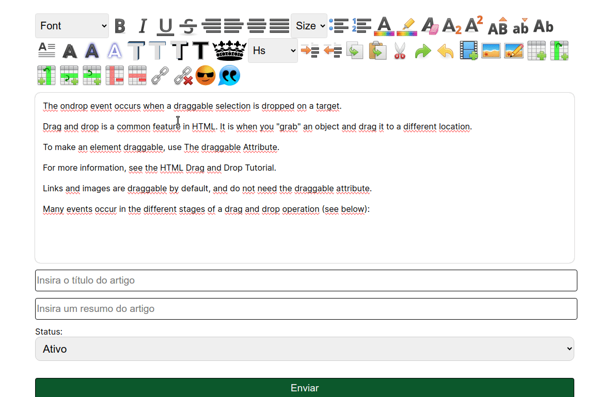

<h1>RffEditor - editor de texto para web</h1>

<h3>O que você encontrará nesse editor?</h3>
<ul>
  <li>Formatação de título com animação</li>
  <li>Opção de inserir gifs e vetores já pre-instalados</li>
  <li>Opção de instalar de modo prático e fácil novos pacotes de gifs</li>
  <li>Inserir citações</li>
  <li>Inserir sombra no texto</li>
  <li>Inserir efeito de neon no texto</li>
  <li>Opção de pré formatação de texto 3D</li>
  <li>Inserir imagem do computador</li>
  <li>Inserir imagem da pasta de imagens do servidor</li>
  <li>Inserir Vídeos do youtube de modo prático e fácil</li>
  <li>E muito mais....</li>
</ul>

><h3>Site</h3>
>Clique no link para acessar o site oficial: <a href="https://rffeditor.infocomrobson.com.br">RffEditor</a>

><h3>Canal do youtube</h3>
>Clique  <a href="https://rffeditor.infocomrobson.com.br">AQUI</a> para acessar o canal oficial com instruções de instalação e de uso do RffEditor

<h2>📚 Technologies</h2>
<ul>
  <li>Javascript</li>
  <li>Html</li>
  <li>Css</li>
  <li>Php</li>
</ul>

<h2>Alterações importantes</h2>
<h3>ex2.class.php</h3>
na linha:
$pasta = '../../imagens/';
colocar a localização da pasta onde as imagens serão salvas. (deve ter a permissão de leitura e escrita para o usuário www-data)

<h3>editorRobsonFarias.css</h3>
Voê deverá inserir com a tag link esse arquivo em todos os arquivos que imprimirem o conteúdo criado pelo editor, ele contem as tags personalizadas. 
Obs.: Não altere nenhum tag e nem mude o nome.
<pre>< link rel="stylesheet" type="text/css" href="rffeditor/editorRobsonFarias.css" /></pre> 

><h2>Obs</h2>
>Essa é uma versão atualizada do editor que eu criei junto com o FAQ <pre>(https://github.com/robsonfdfarias/FAQ | commit de 30/01/2024 - 4f41c20).</pre> Eu atualizei o FAQ para pegar daqui do meu github o editor para um melhor controle da versão e para uso em outros aplicativos.

<h2>Ultimas atualizações</h2>
<h3>Mover, editar(largura e altura) e excluir imagem e/ou vídeo</h3>

<h3>Editar largura e altura (recursos novos) da imagem e/ou vídeo</h3>

<h2>☺Autor</h2>
<strong>Robson Ferreira de Farias</strong> 
<ul>
  <li>Github: <a href="https://github.com/robsonfdfarias">@robsonfdfarias</a></li>
  <li>Linkedin: <a href="https://www.linkedin.com/in/robson-farias-a8b01723a/">@robsonfdfarias</a></li>
  <li>Canais do Youtube: 
  </li>
    <ul>
      <li>@robsonfdfarias: <a href="https://rffeditor.infocomrobson.com.br">RffEditor</a></li>
      <li>@informaticacomrobsonfarias: <a href="https://rffeditor.infocomrobson.com.br">RffEditor</a></li>
    </ul>
</ul>  

▒▒▒▒▒▒▒▒▒▄▄▄▄▒▒▒▒▒▒▒
▒▒▒▒▒▒▄▀▀▓▓▓▀█▒▒▒▒▒▒
▒▒▒▒▄▀▓▓▄██████▄▒▒▒▒
▒▒▒▄█▄█▀░░▄░▄░█▀▒▒▒▒
▒▒▄▀░██▄░░▀░▀░▀▄▒▒▒▒
▒▒▀▄░░▀░▄█▄▄░░▄█▄▒▒▒
▒▒▒▒▀█▄▄░░▀▀▀█▀▒▒▒▒▒
▒▒▒▄▀▓▓▓▀██▀▀█▄▀▀▄▒▒
▒▒█▓▓▄▀▀▀▄█▄▓▓▀█░█▒▒
▒▒▀▄█░░░░░█▀▀▄▄▀█▒▒▒
▒▒▒▄▀▀▄▄▄██▄▄█▀▓▓█▒▒
▒▒█▀▓█████████▓▓▓█▒▒
▒▒█▓▓██▀▀▀▒▒▒▀▄▄█▀▒▒
▒▒▒▀▀▒▒▒▒▒▒▒▒▒▒▒▒▒▒▒